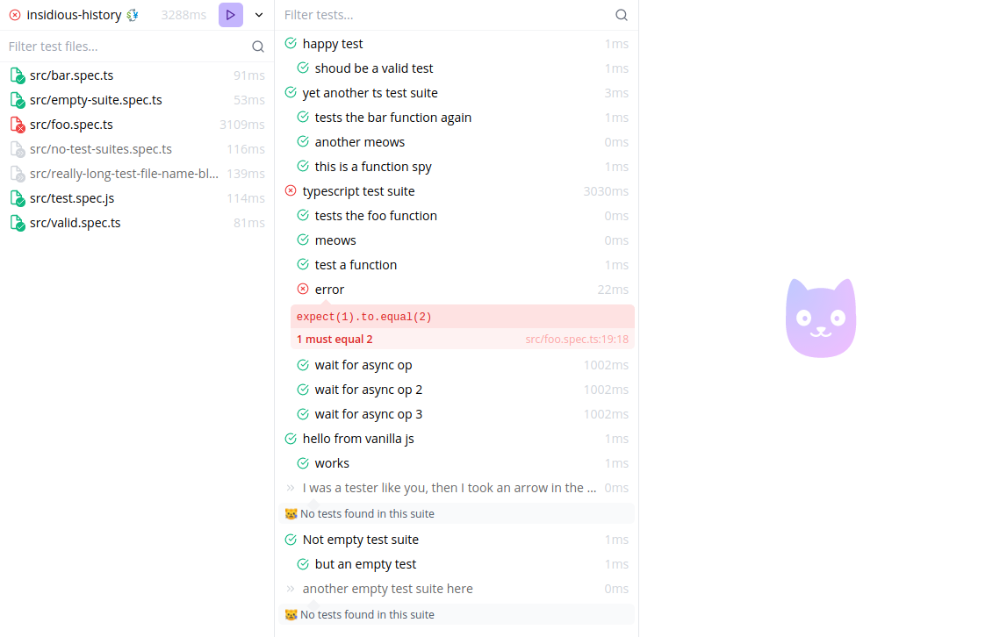

<h1 align="center">Peeky</h1>

A fast and fun test runner for Vite & Node 🐈️

---

[📚 Documentation](https://peeky.netlify.app/) | [📝 Contribute](./CONTRIBUTING.md) | [💚️ Become a Sponsor](https://github.com/sponsors/Akryum)

- 🚀️ **Fast**: Peeky is built from the ground up for optimal performance. Run test faster!
- 🔧️ **No-config**: Sane defaults, with extensive configuration if needed.
- 😻️ **Fun**: The included UI makes running tests fun again! Hack it with the API!
- 🖥️ **Node support**: Test your Node.js libraries and apps, with native ESM support!
- ⚡️ **[Vite](https://vitejs.dev/) powered**: Seamlessly integrate with your Vite app. TypeScript support included.
- 🌐️ **Web apps**: Test your web apps and components made with React, Vue, Angular, etc.

---

## Sponsors

  

