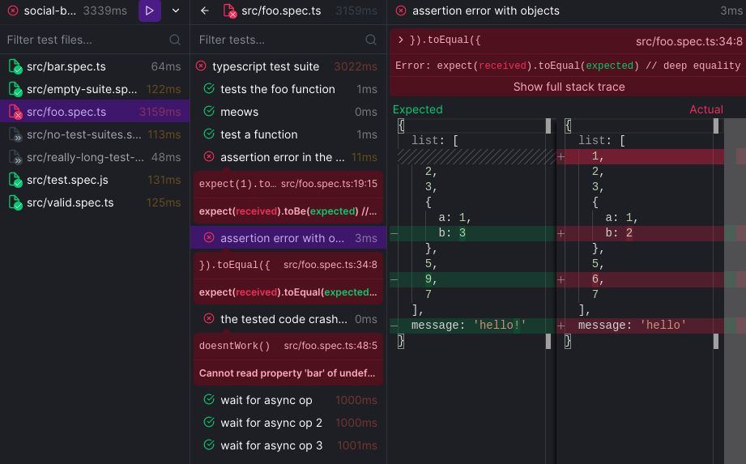

<h1 align="center">Peeky</h1>

A testing framework for curious minds 🐈️

Main features:

- Fast (native code building + parallel runner)
- No config (but configurable if needed)
- Fun (graphical user interface)

Read the [documentation](https://peeky.netlify.app/)

[💚️ Become a Sponsor](https://github.com/sponsors/Akryum)

## Sponsors

